# 知羽图书馆1

这是JAVA课程设计的图书管理系统,最终稿  
初稿见:
- [xiaoyu_library](https://github.com/FxDr2003/xiaoyu_library)

## 作者

* **Fxx**

- [github--@FxDr2003](https://github.com/FxDr2003)
- [CSDN--@Fxx_2003](https://blog.csdn.net/Fx_2003?type=blog)

### 功能说明

此乃JAVA课设的最终稿  
采用mysql+java的swing为UI  
老师给的示例代码太简陋，和我的初稿差不多，当时我上网搜索了许多美化知识教程啥的  
最终实现了此项目  
- 基本数据库操作,查询修改、删除插入等
- Index为入口引导
- 查询数据库实现登陆操作，来判断打开相应权限的主界面
- 主界面有学生界面和管理员界面
- 注册界面和初稿一样，授权码为520
- 查询、修改、添加图书信息
- 添加图书简介，用到了数据库存二进制显示图片etc。。
- 查询修改删除添加借阅记录
- 基本通信功能，管理员消息界面作为服务器，当学生端开启时，则连接可以发送文本消息
- 学生端单独开启会收到提示说管理员不在线，请在工作时间练习

### 问题反思
- 首先是一个基本点,比如添加图书简介时还需要手动填写图书ID和名字，这两个都要填太麻烦了，还要确保id正确
- 管理员界面的顶部长图显示和分隔栏啥的，覆盖住了下面的操作按钮，需要手动拉动分隔栏。
- 一些窗口大小设置不太好，代码的处理显示功能不太全
- 比如说图书简介添加图片时，图片太大而窗口太小则显示不去，当然这也是小问题。

### 项目截图

在这里放置项目的截图，例如:  
  
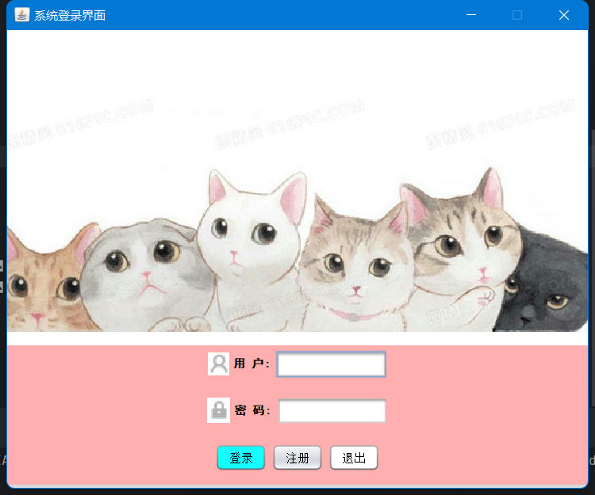  
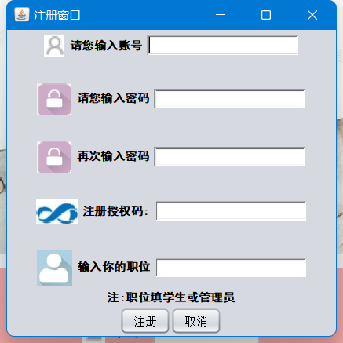  

## 学生界面
- 学生具有基本的查询书籍信息,借书信息
- 查询书籍  
- 借阅书籍
- 和管理员练习(首先要开管理员端才可通信，否则弹窗提示)
- 当然,点击头像可以打开本地文件管理器选择图片更换头像

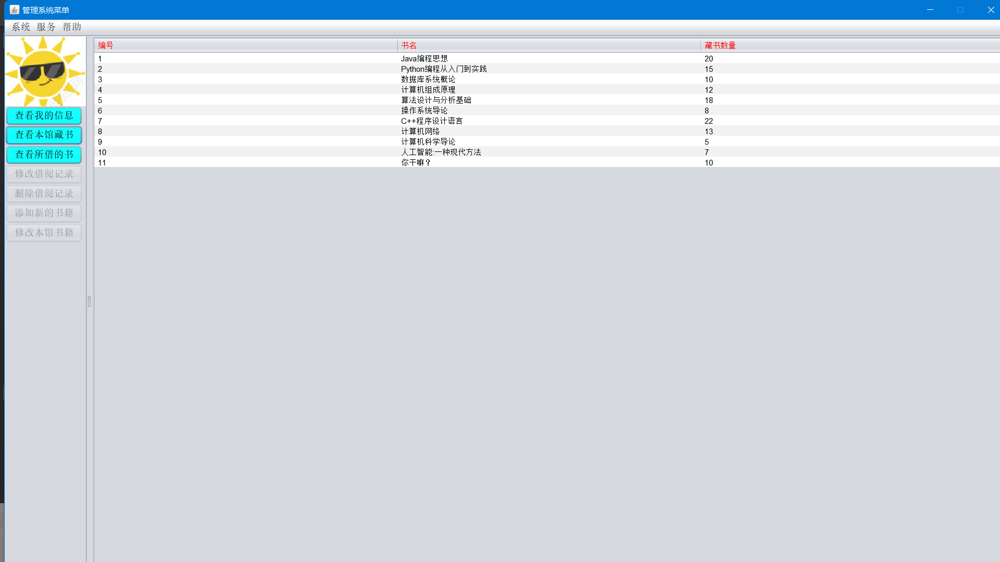  
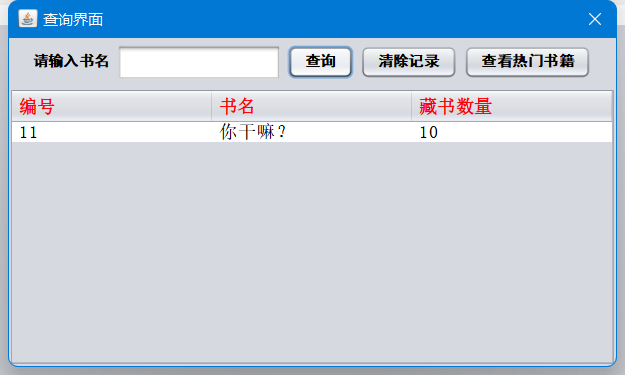  
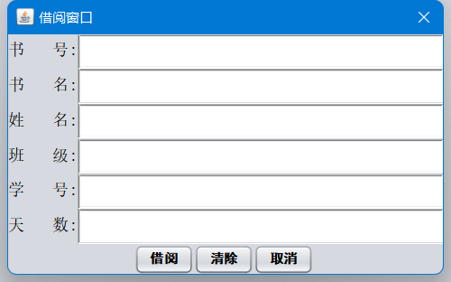  
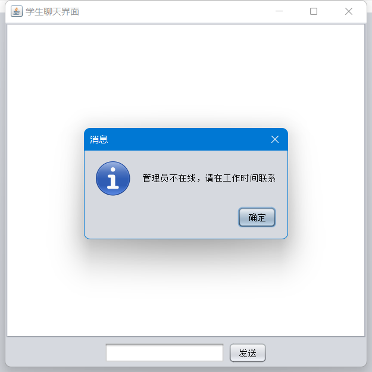  
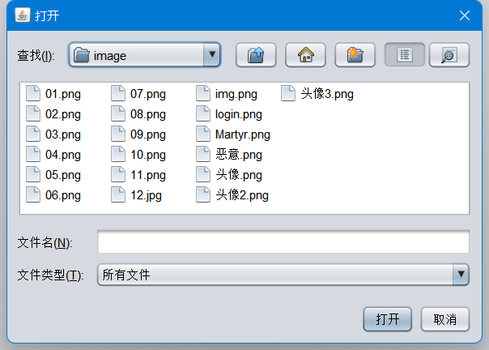  

## 管理员界面
- 基本操作之外
- 添加图书、删除图书
- 修改借阅记录和删除借阅记录
- 右键表格某一行可以打开菜单进行操作
- 双击表格某一栏，假如有表中有这个书籍的信息则打开一个书籍详情页面，展示图片，书名和描述
- 当然可以添加书籍简介
- 通信功能，工作时间内打开管理员消息界面，此时打开学生消息界面，即可通信
- 弹球游戏，传承初稿

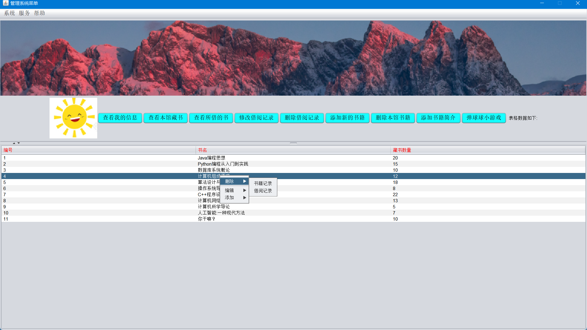  
  
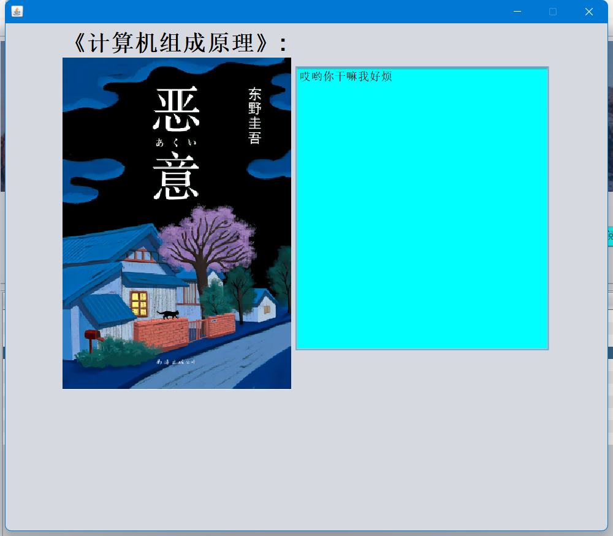  
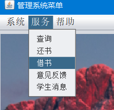  
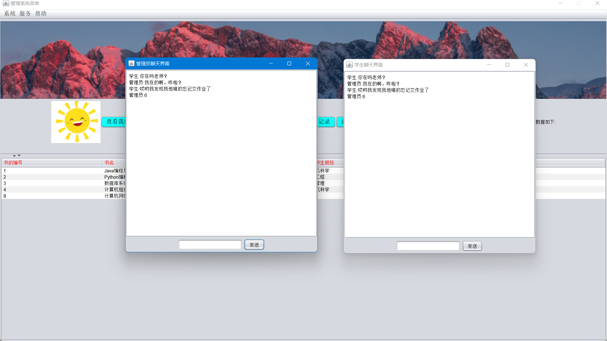  